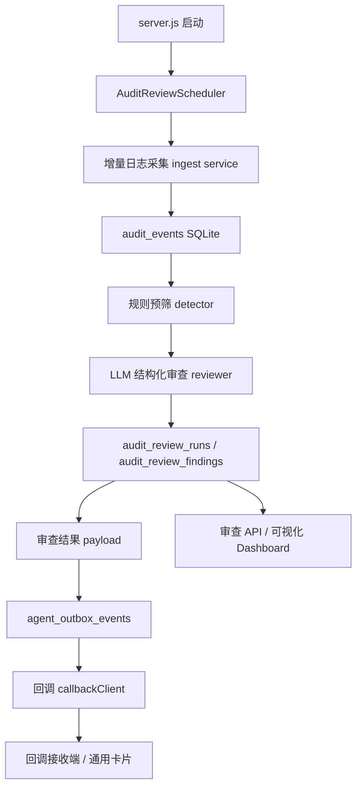

# v1.4 常驻式 LLM 日志审查与主动告警设计方案

> v1.5 delta: review payloads are still delivered through the outbox/callback mechanism, but the implementation no longer treats Flybook/Bot as a required platform. `confidence` has been removed from the active review contract. Dashboard pages now render direct data with Chinese labels and hide empty sections. Finding evidence includes log id, agent id, agent display name, and sanitized log details.

## 1. 文档目标

v1.4 的目标是把当前的 audit-logger-agent 从“可被动查询、可按用户请求分析”的审计工具，升级为“常驻运行、周期采集、主动审核、主动通知、可视化追踪”的审计守护进程。

本次变更围绕三件事展开：

1. Agent 启动后保持常驻，周期性获取其他 Agent 的审计日志，默认建议每 30 分钟执行一次。
2. 每次获取日志后，由 LLM 对高危权限调用、异常调用、连续重复调用、失败调用等进行审查，并主动通过通用回调接收端展示给用户。
3. 为日志审查结果提供可视化能力，并给出推荐方案。

---

## 2. 当前系统现状

截至 v1.3，项目已经具备这些基础能力：

| 能力 | 当前状态 | 可复用程度 |
|------|----------|------------|
| 日志规范 | 已有 `agent-audit-log` v1.0，其他 Agent 输出 NDJSON | 高 |
| 日志采集 | `scripts/ingest.js` 可手动扫描日志目录并写入 SQLite | 高，但目前不是常驻任务 |
| 查询与报表 | `/query`、`/report/daily`、`/report/errors`、`/report/tools` | 高 |
| 常驻 HTTP 服务 | `scripts/server.js` 已常驻运行 | 高 |
| LLM Planner | v1.3 已接入 OpenAI 兼容 LLM，并使用结构化输出 | 高 |
| Outbox 投递 | `agent_outbox_events` 已支持 pending、重试、dead_letter | 高 |
| 回调 | `callbackClient` 可把标准 payload POST 到通用回调接收端 | 高 |

当前主要缺口：

- 日志采集仍是手动 CLI，不会在 server 常驻进程中定时运行。
- LLM 分析目前由用户请求触发，不会自动审查新增日志。
- 审查结果没有独立的数据模型，无法去重、追踪、二次查询。
- 主动通知缺少固定的周期任务来源和默认投递目标。
- 可视化仍停留在原始查询/报表 API，没有面向审查结果的视图。

---

## 3. 设计结论

推荐方案：在现有 `server.js` 常驻进程内新增一个 `AuditReviewScheduler`，默认每 30 分钟运行一次审查周期。

每个审查周期执行以下流程：

1. 增量扫描配置的其他 Agent 日志目录。
2. 将新增 NDJSON 日志去重写入 `audit_events`。
3. 基于本轮时间窗口读取候选事件。
4. 先用本地规则做预筛，降低 LLM 输入量，并保证关键风险即使 LLM 不可用也能被发现。
5. 调用 LLM 进行结构化审查，输出风险分级、证据、解释和建议。
6. 持久化审查批次和风险发现。
7. 生成通用回调投递 payload，写入 outbox。
8. 由现有 outbox flush 机制主动投递给回调接收端。
9. 同时通过审查结果 API 和本地 Web Dashboard 提供后续钻取。

通用回调卡片摘要和本地 Web Dashboard 是 v1.4 的固定可视化组合。每次回调摘要必须携带本地 Dashboard 链接；Dashboard 必须基于通用模板实现，后续审查类页面通过复用模板保持布局、组件和视觉风格一致。



---

## 4. 常驻与周期调度设计

### 4.1 调度策略

默认配置：

- `enabled`: true
- `intervalMinutes`: 30
- `initialDelaySeconds`: 30
- `lookbackOverlapMinutes`: 5
- `maxEventsPerReview`: 500

推荐在服务启动 30 秒后先跑一次审查，然后每 30 分钟跑一次。这样既满足“启动后常驻、定期获取”，也避免刚启动时数据库、HTTP 服务、配置加载还未完全稳定。

### 4.2 时间窗口

每次审查使用一个明确窗口：

```text
window_to = now
window_from = last_successful_window_to - lookbackOverlapMinutes
```

如果没有成功历史记录，则使用：

```text
window_from = now - intervalMinutes
```

保留 5 分钟重叠窗口是为了覆盖日志文件写入延迟、Agent 时钟轻微漂移、上一次审查中途失败等情况。重复事件由 `row_hash` 和后续 `finding_hash` 去重。

### 4.3 并发控制

同一进程内只允许一个审查周期运行。

- 如果上一轮还在执行，下一轮直接跳过，并记录 `audit_review_runs.status = skipped`。
- 如果采集或 LLM 审查失败，当前轮标记 `failed`，下一轮仍按周期继续。
- Outbox 投递失败不影响审查周期完成，交给现有重试机制处理。

并发控制必须以数据库租约为准，而不是只依赖进程内变量。这样即使未来误启动两个 server 进程，或手动触发 API 与定时任务同时发生，也不会重复审查和重复通知。

建议新增轻量锁表：

```sql
CREATE TABLE IF NOT EXISTS audit_review_locks (
  lock_name TEXT PRIMARY KEY,
  owner_id TEXT NOT NULL,
  lease_expires_at TEXT NOT NULL,
  updated_at TEXT NOT NULL
);
```

锁规则：

- 固定使用 `lock_name = 'audit_review_scheduler'`。
- 每轮审查开始前先获取租约，租约默认 10 分钟。
- 长审查任务需要定期刷新 `lease_expires_at`。
- 如果租约未过期，定时任务记录 `skipped`；手动触发 API 返回 `409 review_already_running` 和当前 `review_id`。
- 如果租约已过期，新任务可抢占，并把旧 `running` review 标记为 `failed` 或 `stale_recovered`。

### 4.4 启动恢复

server 启动时必须恢复异常中断的审查任务：

1. 查询 `audit_review_runs.status = 'running'` 且 `started_at` 或 `lease_expires_at` 已超时的记录。
2. 将这些记录标记为 `failed`，`error_code = 'review_interrupted'`。
3. 释放或覆盖过期 `audit_review_locks`。
4. 记录一条 runtime audit event，方便后续排查。

这与现有 `recoverInflightRuns` 的思路一致：重启后不让任务长期卡在 running，也不让下一轮审查被旧状态阻塞。

### 4.5 与现有 server 的关系

不建议为 v1.4 新增独立 daemon 入口。推荐继续以 `node scripts/server.js --port 9320` 作为常驻入口，并在 server boot 阶段启动调度器。

原因：

- 当前 `server.js` 已经常驻，并负责 outbox flush。
- 审查任务需要复用同一个 SQLite、LLM client、callback client 和配置。
- 避免两个进程同时写入 SQLite 或重复投递通知。

---

## 5. 增量日志采集设计

### 5.1 复用现有采集能力

现有 `scripts/lib/indexer.js` 的 `ingestAll(db, config, since)` 可以继续复用，但建议在 v1.4 抽出一个服务层：

```js
createAuditIngestService({ db, config })
```

提供：

```js
ingestSince({ sinceDate, reviewId }): {
  inserted: number,
  scannedFiles: number,
  parseErrors: Array<{ agent_id, file, error }>
}
```

这样 CLI `scripts/ingest.js` 和常驻调度器可以共享同一套逻辑。

### 5.2 采集范围

短期仍按文件名日期过滤：

```text
audit-YYYY-MM-DD.jsonl
```

每轮使用 `window_from` 所在日期作为 `sinceDate`，扫描可能包含窗口事件的日志文件。真正的事件窗口过滤交给 SQLite 查询完成。

### 5.3 解析错误处理

解析错误也需要进入审查结果，因为日志格式错误本身就是可观测性风险。

建议将解析错误作为 `ingest_parse_error` 类 finding：

- 严重程度默认 `medium`
- 如果同一 agent 连续多个文件解析失败，升级为 `high`
- 回调摘要中展示 parse error 数量和前 3 条样例

### 5.4 文件游标与大文件性能

仅按 `sinceDate` 扫描文件适合作为第一层过滤，但常驻 30 分钟调度后，大日志文件会被反复完整读取。v1.4 应新增文件游标，避免同一天日志越大，后续每轮采集越慢。

建议新增表：

```sql
CREATE TABLE IF NOT EXISTS audit_ingest_cursors (
  agent_id TEXT NOT NULL,
  file_path TEXT NOT NULL,
  file_mtime_ms INTEGER NOT NULL,
  file_size_bytes INTEGER NOT NULL,
  offset_bytes INTEGER NOT NULL DEFAULT 0,
  last_ingested_at TEXT NOT NULL,
  last_error TEXT,
  PRIMARY KEY (agent_id, file_path)
);
```

采集规则：

- 如果文件 size 和 mtime 未变化，跳过。
- 如果文件变大，从 `offset_bytes` 继续读取新增内容。
- 如果文件变小，视为轮转或截断，从头读取并依赖 `row_hash` 去重。
- 如果增量片段最后一行不是完整 JSON 行，保留到下一轮再解析。
- `row_hash` 仍是最终幂等保障，游标只负责减少重复 IO。

---

## 6. 审查引擎设计

### 6.1 两阶段审查

审查引擎分为两层：

1. **规则预筛层**：确定性、低成本、可测试。
2. **LLM 判断层**：做上下文解释、风险归因、优先级排序和行动建议。

不建议把全部判断直接交给 LLM。规则层能保证基础风险不会因模型异常而漏掉，也能减少 token 成本。

### 6.2 风险类别

v1.4 首批支持以下类别：

| 类别 | code | 说明 |
|------|------|------|
| 高危权限调用 | `high_risk_permission` | 写入、删除、外部系统变更、权限提升、批量操作等敏感工具调用 |
| 异常调用 | `anomalous_call` | 非预期渠道、非预期用户、未知工具、超长耗时、业务字段异常、trace/span 异常 |
| 连续重复调用 | `repeated_call` | 同一 agent/tool/product/trace 在短窗口内重复调用超过阈值 |
| 失败调用 | `failed_call` | `status` 为 `error`、`timeout`、`cancelled` 的工具或 agent 事件 |
| 日志完整性问题 | `trace_integrity` | `tool.start` 缺少对应 `tool.end/tool.error`，或 span 关系不完整 |
| 日志采集/解析问题 | `ingest_parse_error` | NDJSON 解析失败、必填字段缺失、字段枚举不合法 |

### 6.3 严重程度

使用四级严重程度：

| 严重程度 | 含义 | 默认通知 |
|----------|------|----------|
| `critical` | 可能导致数据破坏、权限越界、持续失败或大范围影响 | 必推送 |
| `high` | 明确异常，需要用户尽快查看 | 必推送 |
| `medium` | 有风险信号，建议在工作流中确认 | 默认推送摘要 |
| `low` | 信息性发现，主要用于趋势和审计留存 | 默认不单独推送 |

### 6.4 本地规则预筛

规则层建议输出候选 finding，而不是直接产出最终结论。候选项进入 LLM，由 LLM 做解释和合并。

首批规则：

| 规则 | 建议默认值 |
|------|------------|
| 失败调用 | `status IN ('error', 'timeout', 'cancelled')` |
| 连续重复调用 | 同一 `agent_id + tool_name + product_id` 10 分钟内 >= 5 次 |
| 高危工具名 | 匹配 `delete`、`write`、`update`、`deploy`、`permission`、`credential`、`shell`、`browser.runScript` 等模式 |
| 超长耗时 | `duration_ms >= 30000` |
| 未知工具 | 不在配置的 agent tool allowlist 内 |
| 异常渠道 | 高危工具从非预期 `channel` 触发 |
| span 不完整 | 同一 span 只有 `tool.start`，窗口结束后未看到终态 |

这些阈值必须可配置，不能硬编码在 LLM prompt 里。

### 6.5 LLM 审查职责

LLM 负责：

- 合并同类候选项，避免一堆重复告警刷屏。
- 结合 trace、agent、tool、错误信息判断严重程度。
- 给出用户可读解释。
- 给出建议动作，例如"检查某 trace"、"确认该工具调用是否授权"、"查看回调投递失败原因"。
- 输出结构化 JSON，必须经过本地 schema 校验。

LLM 不负责：

- 直接执行工具。
- 直接修改数据库状态。
- 直接发送回调消息。
- 绕过本地规则和 schema 校验。

### 6.6 LLM 输入裁剪与脱敏

传给 LLM 的内容应是审查候选摘要，而不是完整原始日志。

每条 evidence 建议包含：

- `event_id`
- `ts`
- `agent_id`
- `tool_name`
- `event`
- `status`
- `duration_ms`
- `trace_id`
- `span_id`
- `product_id`
- `error_code`
- `error_message`
- `result_summary`

不建议传：

- 原始 `input`
- 原始 `output`
- 未脱敏 URL token、cookie、API key、authorization header
- 长 stack trace

如果未来需要传原始字段，必须先经过 redaction 和长度截断。

### 6.7 LLM 输出契约

建议新增审查结果 schema：

```json
{
  "type": "audit_review",
  "review_id": "review_sample_001",
  "window": {
    "from": "2026-07-03T10:00:00.000Z",
    "to": "2026-07-03T10:30:00.000Z"
  },
  "summary": {
    "title": "审查发现 3 个高风险问题",
    "overview": "过去 30 分钟共审查 128 条事件，其中失败调用 9 条，高危权限调用 2 条。",
    "severity_counts": {
      "critical": 0,
      "high": 3,
      "medium": 5,
      "low": 2
    }
  },
  "findings": [
    {
      "category": "failed_call",
      "severity": "high",
      "confidence": 0.92,
      "agent_id": "mt-agent",
      "tool_name": "publicTraffic.runReport",
      "trace_id": "trace_review_sample_001",
      "title": "publicTraffic.runReport 连续失败",
      "summary": "10 分钟内同一工具失败 5 次，错误码均为 upstream_timeout。",
      "evidence_event_ids": [123, 124, 125],
      "recommendation": "优先检查上游服务可用性和该 trace 的请求参数。",
      "requires_action": true
    }
  ]
}
```

本地校验要求：

- `severity` 必须属于固定枚举。
- `category` 必须属于固定枚举。
- `evidence_event_ids` 必须引用本轮候选事件。
- `confidence` 必须是 0 到 1 的数字。
- 单条 `summary` 和 `recommendation` 需要长度上限，避免回调卡片过长。

### 6.8 策略与 Prompt 版本化

每轮审查必须记录当时使用的规则策略、Prompt 和审查器版本。否则后续规则阈值、风险分类或 Prompt 调整后，历史 finding 难以复盘。

建议版本字段：

- `risk_policy_version`：规则配置版本，例如 `risk-policy-v1`。
- `prompt_version`：LLM 审查 prompt 版本，例如 `audit-review-prompt-v1`。
- `reviewer_version`：审查流程版本，例如 `audit-reviewer-v1`。

版本化要求：

- 每次调整默认阈值、分类规则、高危工具模式或 LLM prompt，都必须递增对应版本。
- `audit_review_runs` 记录本轮使用的版本。
- `audit_review_findings` 可冗余记录版本，方便单条 finding 离线导出时自解释。
- Dashboard finding 详情页应展示这些版本，避免用户把策略变化误读为系统不一致。

---

## 7. 审查结果持久化设计

### 7.1 新增表：`audit_review_runs`

记录每一轮周期审查。

```sql
CREATE TABLE IF NOT EXISTS audit_review_runs (
  review_id TEXT PRIMARY KEY,
  window_from TEXT NOT NULL,
  window_to TEXT NOT NULL,
  status TEXT NOT NULL,
  trigger_type TEXT NOT NULL,
  interval_minutes INTEGER,
  scanned_files INTEGER NOT NULL DEFAULT 0,
  inserted_events INTEGER NOT NULL DEFAULT 0,
  parse_error_count INTEGER NOT NULL DEFAULT 0,
  candidate_event_count INTEGER NOT NULL DEFAULT 0,
  finding_count INTEGER NOT NULL DEFAULT 0,
  llm_model TEXT,
  risk_policy_version TEXT NOT NULL,
  prompt_version TEXT,
  reviewer_version TEXT NOT NULL,
  error_code TEXT,
  error_message TEXT,
  started_at TEXT NOT NULL,
  finished_at TEXT
);
```

`status` 建议值：

- `running`
- `completed`
- `completed_degraded`
- `failed`
- `skipped`
- `stale_recovered`

其中 `completed_degraded` 表示 LLM 审查失败，但规则层仍产出并通知了基础结果。

### 7.2 新增表：`audit_review_findings`

记录每条审查发现。

```sql
CREATE TABLE IF NOT EXISTS audit_review_findings (
  finding_id TEXT PRIMARY KEY,
  review_id TEXT NOT NULL,
  finding_hash TEXT NOT NULL,
  category TEXT NOT NULL,
  severity TEXT NOT NULL,
  confidence REAL,
  agent_id TEXT,
  tool_name TEXT,
  trace_id TEXT,
  product_id TEXT,
  title TEXT NOT NULL,
  summary TEXT NOT NULL,
  recommendation TEXT,
  requires_action INTEGER NOT NULL DEFAULT 0,
  evidence_event_ids_json TEXT NOT NULL,
  evidence_json TEXT,
  status TEXT NOT NULL DEFAULT 'open',
  occurrence_count INTEGER NOT NULL DEFAULT 1,
  created_at TEXT NOT NULL,
  last_seen_at TEXT NOT NULL,
  last_notified_at TEXT,
  resolved_at TEXT,
  snoozed_until TEXT,
  acknowledged_at TEXT,
  acknowledged_by TEXT,
  risk_policy_version TEXT NOT NULL,
  prompt_version TEXT,
  reviewer_version TEXT NOT NULL
);

CREATE UNIQUE INDEX IF NOT EXISTS idx_audit_review_findings_hash
ON audit_review_findings(finding_hash);

CREATE INDEX IF NOT EXISTS idx_audit_review_findings_review
ON audit_review_findings(review_id);

CREATE INDEX IF NOT EXISTS idx_audit_review_findings_severity
ON audit_review_findings(severity, created_at);
```

`finding_hash` 用于跨重叠窗口去重。建议由以下字段计算：

```text
category + agent_id + tool_name + trace_id + product_id + normalized_error_code
```

`severity` 不应进入 `finding_hash`。同一问题在后续窗口升级或降级时，应更新同一条 finding 的 `severity`、`occurrence_count` 和 `last_seen_at`，而不是创建一条新 finding。

finding 生命周期建议：

- `open`：仍需关注。
- `acknowledged`：用户已确认看到，但问题未必解决。
- `snoozed`：在 `snoozed_until` 前不再重复推送。
- `resolved`：后续窗口未再出现或用户手动关闭。

通知去重规则：

- 新 finding 首次达到 `minSeverity` 时通知。
- 已通知 finding 在 `last_notified_at` 后继续出现时，只更新 `occurrence_count`，默认不重复推送。
- 如果 severity 升级到更高等级，允许再次通知。
- `snoozed` finding 在 `snoozed_until` 前不通知，但仍更新 `last_seen_at`。

### 7.3 Outbox 复用策略

现有 `agent_outbox_events.run_id` 没有外键约束，短期可把 `review_id` 写入该字段，事件类型区分为：

- `audit_review_summary`
- `audit_review_finding`
- `audit_review_degraded`

中期更干净的做法是为 outbox 增加：

- `source_type`
- `source_id`

但这需要迁移现有表结构。v1.4 MVP 可先复用 `run_id = review_id`，避免为了字段命名做大规模迁移。

### 7.4 数据保留与清理

周期审查会持续写入 review、finding、outbox 和 runtime audit 事件，需要明确保留策略，避免 SQLite 长期膨胀。

建议默认策略：

- `audit_review_runs`：保留 180 天。
- `audit_review_findings`：open/snoozed 永久保留；resolved 保留 180 天。
- `agent_outbox_events`：delivered 保留 30 天；dead_letter 保留 180 天。
- `audit_ingest_cursors`：只保留仍存在的日志文件游标；文件不存在超过 30 天后清理。
- `audit_events`：沿用现有审计库策略；如果后续要清理，必须先确认合规要求。

清理任务应作为低优先级维护任务运行，不应阻塞审查周期。清理动作本身要写 runtime audit event。

---

## 8. 主动回调通知设计

### 8.1 投递边界

推荐继续保持当前边界：

- audit-logger-agent 负责产出标准结构化 payload，并调用回调接收端 URL。
- 回调接收端服务负责把 payload 渲染成最终展示（如卡片、IM 消息等）并投递到目标平台。
- audit-logger-agent 不直接持有目标平台的 secret（如 IM 平台 tenant secret、app secret 或 webhook secret）。

如果后续必须由 audit-logger-agent 直连外部 webhook，webhook URL 或 secret 必须放在 `.config` 或环境变量，不得写入 `config.json`。

### 8.2 通知目标配置

新增配置块建议：

```json
{
  "auditReview": {
    "enabled": true,
    "intervalMinutes": 30,
    "initialDelaySeconds": 30,
    "lookbackOverlapMinutes": 5,
    "maxEventsPerReview": 500,
    "notification": {
      "mode": "callback",
      "callbackUrl": "http://127.0.0.1:9999/audit-review-events",
      "minSeverity": "medium",
      "sendEmptyReview": false
    }
  }
}
```

`callbackUrl` 是回调接收端提供给 audit-logger-agent 的接收地址。如果该地址包含敏感 token，应改放 `.config`，并让 `config.json` 只保存非敏感逻辑配置。

### 8.3 通知节流

避免每 30 分钟刷屏，建议采用以下策略：

- `critical` 和 `high`：每条 finding 必推送。
- `medium`：进入批量摘要，默认不单独推送。
- `low`：只入库和可视化，不推送。
- 如果本轮无 finding，默认不推送；可通过 `sendEmptyReview` 打开“平安报告”。

### 8.4 通用回调投递 payload

audit-logger-agent 输出给回调接收端的 payload 建议与具体平台卡片解耦：

```json
{
  "type": "audit_review_summary",
  "review_id": "review_20260703_103000",
  "title": "审计日志审查发现 3 个高风险问题",
  "summary": "过去 30 分钟审查 128 条事件，发现 high=3、medium=5。",
  "dashboard_url": "http://127.0.0.1:9320/dashboard/audit-reviews/review_20260703_103000",
  "window": {
    "from": "2026-07-03T10:00:00.000Z",
    "to": "2026-07-03T10:30:00.000Z"
  },
  "severity_counts": {
    "critical": 0,
    "high": 3,
    "medium": 5,
    "low": 2
  },
  "top_findings": [
    {
      "finding_id": "finding_review_sample_001",
      "severity": "high",
      "category": "failed_call",
      "title": "publicTraffic.runReport 连续失败",
      "agent_id": "mt-agent",
      "tool_name": "publicTraffic.runReport",
      "summary": "10 分钟内失败 5 次，错误码均为 upstream_timeout。"
    }
  ],
  "actions": [
    {
      "id": "open_dashboard",
      "label": "打开 Dashboard",
      "url": "http://127.0.0.1:9320/dashboard/audit-reviews/review_20260703_103000"
    }
  ]
}
```

回调渲染建议：

- 顶部展示窗口时间、总事件数、风险总数。
- 使用颜色区分 `critical/high/medium/low`。
- 只展示 Top 3 到 Top 5 findings，避免卡片过长。
- 必须附带 `dashboard_url`，并提供"打开 Dashboard"按钮跳转到本地审查详情页。
- 如果回调渲染端无法访问本地 Dashboard，应仍展示完整摘要，并把 `dashboard_url` 作为纯文本链接保留。
- 后续可增加"已确认""忽略本规则 24 小时"等交互，但不作为 MVP 必须项。

---

## 9. 可视化方案

### 9.1 已确定方案

v1.4 可视化明确采用 **本地 Web Dashboard + 通用回调卡片摘要**。

- 通用回调卡片摘要负责主动触达用户，展示本轮审查窗口、风险数量、Top findings 和 Dashboard 链接。
- 本地 Web Dashboard 负责历史趋势、审查批次列表、finding 详情、证据链钻取和后续复用展示。
- 不再把 Markdown/HTML 静态报告或外部 BI 作为 v1.4 默认方案；这些可以作为后续导出或集成能力。

### 9.2 回调卡片与 Dashboard 链接契约

每一条 `audit_review_summary` payload 必须包含 `dashboard_url`。回调渲染端展示卡片时必须把该链接展示为主操作按钮。

推荐 URL 结构：

```text
GET /dashboard
GET /dashboard/audit-reviews/{reviewId}
GET /dashboard/audit-findings/{findingId}
```

其中：

- `/dashboard` 是审查总览页。
- `/dashboard/audit-reviews/{reviewId}` 是某一轮审查详情页。
- `/dashboard/audit-findings/{findingId}` 是单条 finding 证据页。

`dashboard_url` 由 audit-logger-agent 根据 `auditReview.visualization.baseUrl` 和 route path 生成。回调接收端不拼接 URL，只渲染 payload 中的链接，避免接收端侧重复实现路由规则。

### 9.3 Dashboard 通用模板规范

Dashboard 必须做成可复用模板，而不是为 v1.4 审查页面写一次性 UI。

建议抽象一个通用模板层：

```text
DashboardShell
  HeaderBar
  TimeRangeBar
  SummaryMetricGrid
  SeverityLegend
  FilterBar
  DataSection
  EvidenceTable
  EmptyState
  ErrorState
```

模板设计原则：

- **统一布局**：所有审查类页面使用相同 Header、时间范围、指标卡、筛选条和内容区结构。
- **统一视觉语言**：严重程度颜色、状态标签、表格密度、按钮样式、空状态和错误状态保持一致。
- **数据驱动**：模板只接收 `title`、`summaryMetrics`、`filters`、`sections`、`tables`、`actions` 等结构化数据，不把审查业务写死在 HTML 中。
- **可扩展模块**：后续新增 agent 健康检查、工具调用趋势、回调投递监控等页面时，继续复用同一套模板组件。
- **本地优先**：默认不依赖外部 CDN、外部图表服务或登录态；需要图表时优先使用内置轻量 SVG/Canvas 或本地静态资源。

建议模板输入结构：

```json
{
  "page": {
    "title": "审计审查 Dashboard",
    "subtitle": "最近 24 小时风险概览",
    "updated_at": "2026-07-03T10:30:00.000Z"
  },
  "summary_metrics": [
    { "label": "Critical", "value": 0, "tone": "critical" },
    { "label": "High", "value": 3, "tone": "high" },
    { "label": "Medium", "value": 5, "tone": "medium" }
  ],
  "filters": [
    { "id": "severity", "type": "select", "label": "Severity" },
    { "id": "agent_id", "type": "select", "label": "Agent" }
  ],
  "sections": [
    {
      "id": "latest_findings",
      "title": "最新风险",
      "type": "table",
      "data_source": "/v1/audit-findings?limit=20"
    }
  ]
}
```

### 9.4 Dashboard MVP 内容

总览页包含：

- 最近 24 小时风险数量趋势。
- 当前 open findings 按严重程度分布。
- Top risky agents。
- Top failed tools。
- 最近审查批次列表。
- 最新 high/critical findings 列表。
- Outbox dead letter 数量。

审查详情页包含：

- 本轮审查窗口、状态、扫描文件数、新增事件数、候选事件数、finding 数。
- 本轮 severity 分布和 category 分布。
- Top findings 列表。
- LLM 降级状态，例如 `completed_degraded`。
- 通用回调摘要 payload 预览，方便排查接收端展示问题。

Finding 详情页包含：

- finding 标题、严重程度、类别、状态。
- 影响的 agent、tool、trace、product。
- LLM 解释和建议。
- evidence event 表格。
- 原始 `/query?trace_id=...` 链接。
- 关联审查批次链接。

### 9.5 API 与页面同步建设

v1.4 不再采用“API 优先、页面随后”的宽松策略。Dashboard 是本次方案的一部分，API 和页面应在同一阶段交付。

建议新增只读 API：

```text
GET  /v1/audit-reviews
GET  /v1/audit-reviews/{reviewId}
GET  /v1/audit-findings
GET  /v1/audit-findings/{findingId}
POST /v1/audit-reviews/run
```

`POST /v1/audit-reviews/run` 用于手动触发一轮审查，方便测试和应急。

建议新增页面路由：

```text
GET  /dashboard
GET  /dashboard/audit-reviews/{reviewId}
GET  /dashboard/audit-findings/{findingId}
```

页面应通过同源 API 获取数据，保持 Dashboard 模板和 API 数据契约解耦。

### 9.6 Dashboard 与审查 API 访问控制

Dashboard 和 `/v1/audit-*` API 默认只面向本机或内网运维场景，不应无鉴权暴露到公网。

默认安全策略：

- server 默认继续监听 `127.0.0.1`。
- Dashboard 只读页面可以无 token 本机访问。
- `POST /v1/audit-reviews/run` 属于主动执行入口，必须要求 admin token。
- 如果 `bindHost` 改为非 loopback 地址，Dashboard 和所有 `/v1/audit-*` API 都必须启用 bearer token。
- CORS 默认只允许同源；只有明确配置 `allowedOrigins` 时才允许跨源。
- 回调卡片中的 `dashboard_url` 只作为跳转链接，不携带 token。

建议鉴权方式：

```text
Authorization: Bearer <AUDIT_AGENT_DASHBOARD_TOKEN>
```

安全失败行为：

- 未配置 token 且尝试对外监听时，server 启动失败。
- 缺少 token 访问受保护 API 时返回 `401 unauthorized`。
- token 无效时返回 `403 forbidden`。
- 手动触发审查时如果已有审查在运行，返回 `409 review_already_running`。

---

## 10. 配置设计

建议 `config.json` 新增非敏感配置：

```json
{
  "auditReview": {
    "enabled": true,
    "intervalMinutes": 30,
    "initialDelaySeconds": 30,
    "lookbackOverlapMinutes": 5,
    "maxEventsPerReview": 500,
    "notification": {
      "mode": "callback",
      "callbackUrl": "http://127.0.0.1:9999/audit-review-events",
      "minSeverity": "medium",
      "sendEmptyReview": false
    },
    "http": {
      "bindHost": "127.0.0.1",
      "requireDashboardToken": false,
      "allowedOrigins": ["http://127.0.0.1:9320"]
    },
    "riskPolicy": {
      "version": "risk-policy-v1",
      "repeatWindowMinutes": 10,
      "repeatThreshold": 5,
      "slowCallDurationMs": 30000,
      "highRiskToolPatterns": [
        "*delete*",
        "*write*",
        "*update*",
        "*deploy*",
        "*permission*",
        "*credential*",
        "shell.*",
        "browser.runScript"
      ],
      "agentToolAllowlists": {
        "rental-price-agent": [],
        "mt-agent": []
      }
    },
    "llmReview": {
      "promptVersion": "audit-review-prompt-v1",
      "reviewerVersion": "audit-reviewer-v1"
    },
    "visualization": {
      "enabled": true,
      "baseUrl": "http://127.0.0.1:9320",
      "dashboardPath": "/dashboard",
      "template": "audit-review-dashboard-v1",
      "attachDashboardUrlToCallback": true
    }
  }
}
```

如果 `callbackUrl` 或 `baseUrl` 在实际环境中包含 token，应该迁移到 `.config` 或环境变量：

- `AUDIT_AGENT_REVIEW_CALLBACK_URL`
- `AUDIT_AGENT_REVIEW_BASE_URL`
- `AUDIT_AGENT_DASHBOARD_TOKEN`

配置加载优先级沿用现有策略：

```text
进程环境变量 > .config 文件 > config.json 非敏感配置
```

---

## 11. 模块划分

建议新增目录：

```text
src/auditReview/
  scheduler.js          # 周期调度、并发控制、启动/停止
  ingestService.js      # 常驻模式下复用日志采集
  ingestCursorStore.js  # 文件游标与增量读取状态
  candidateDetector.js  # 本地规则预筛
  llmReviewer.js        # LLM 结构化审查
  reviewSchema.js       # LLM 输出 JSON schema 与本地校验
  reviewStore.js        # audit_review_runs/findings 持久化
  notification.js       # 审查结果转 outbox payload
  visualization.js      # dashboard/API 数据聚合
  dashboardTemplate.js  # 通用 Dashboard 模板渲染
  dashboardAuth.js      # Dashboard 与审查 API 鉴权
```

与现有模块关系：

| 新模块 | 依赖现有模块 |
|--------|--------------|
| `ingestService.js` | `scripts/lib/indexer.js`、`scripts/lib/db.js` |
| `ingestCursorStore.js` | SQLite、日志文件元数据 |
| `candidateDetector.js` | `queryEvents`、`audit_events` schema |
| `llmReviewer.js` | `openaiResponsesClient`、LLM config |
| `notification.js` | `outboxStore`、`eventPublisher` 或直接 enqueue |
| `visualization.js` | `reviewStore`、`queryEvents` |
| `dashboardAuth.js` | `.config` / 环境变量 / HTTP request headers |

---

## 12. 错误处理与降级

### 12.1 日志采集失败

- 当前轮 `audit_review_runs.status = failed`。
- 记录 `error_code = ingest_error`。
- 如果通知配置允许，可发送 `audit_review_degraded`，提示本轮审查未完成。

### 12.2 LLM 调用失败

不应直接丢弃本轮审查。

推荐行为：

- 规则层 findings 入库。
- `audit_review_runs.status = completed_degraded`。
- 回调推送中明确标注"LLM 审查失败，本轮仅包含规则检测结果"。
- 下轮继续正常执行。

### 12.3 回调投递失败

沿用 outbox：

- 失败后保持 `pending` 并指数退避。
- 超过最大次数后进入 `dead_letter`。
- Dashboard 中展示 dead letter 数量。

### 12.4 数据量过大

如果窗口内事件超过 `maxEventsPerReview`：

- 优先保留失败、高危、慢调用、重复调用候选。
- 对普通成功事件只做统计，不传给 LLM。
- 在 review summary 中标注“已裁剪输入”。

### 12.5 审查系统自身审计事件

audit-logger-agent 在审查其他 Agent 的同时，也必须记录自己的审查生命周期事件，避免周期任务失败后只能看控制台日志。

建议新增 runtime audit events：

| event | status | 说明 |
|-------|--------|------|
| `review.start` | `ok` | 一轮审查开始，包含 `review_id`、窗口、触发类型 |
| `review.lock.skipped` | `ok` | 因已有有效租约跳过 |
| `review.ingest.completed` | `ok/error` | 采集完成或失败，包含扫描文件数、新增事件数、解析错误数 |
| `review.detector.completed` | `ok/error` | 规则预筛完成或失败，包含候选数量 |
| `review.llm.completed` | `ok/error` | LLM 审查完成或失败，包含模型和 prompt 版本 |
| `review.notification.enqueued` | `ok/error` | 回调摘要写入 outbox |
| `review.completed` | `ok/error` | 本轮审查结束，包含最终状态 |
| `review.recovered` | `ok/error` | 启动时恢复 stale running review |

这些事件继续写入 `audit_events`，`agent_id` 使用 `audit-logger-agent`，`tool_name` 使用 `audit.review` 或更细粒度名称。

---

## 13. 安全与隐私

v1.4 必须遵守以下约束：

- 不把真实 LLM API key、目标平台 app secret、webhook secret 写入 `config.json`、SQLite 或文档示例。
- 发送给 LLM 的 evidence 必须是摘要字段，默认不包含原始 input/output。
- 回调通知中不展示敏感参数，只展示 tool、agent、trace、错误摘要和建议。
- LLM 输出必须本地 schema 校验后才能入库或投递。
- 用户确认、忽略、关闭 finding 等操作后续必须写审计日志。
- Dashboard 和审查 API 默认不得公网裸奔；对外监听时必须启用 token 鉴权和受限 CORS。
- 手动触发审查 API 必须鉴权，避免任何能访问 HTTP 端口的人触发 LLM 调用和回调通知。

---

## 14. 分阶段实施计划

### 阶段 1：常驻调度与增量采集

目标：

- 在 `server.js` 启动后启动 `AuditReviewScheduler`。
- 每 30 分钟执行一次 ingest。
- 新增 `audit_review_runs` 表记录周期执行状态。
- 新增 `audit_review_locks` 和 stale review 恢复逻辑。
- 新增 `audit_ingest_cursors`，支持按文件游标增量读取。
- 支持手动触发 API `POST /v1/audit-reviews/run`。

验收：

- 启动 server 后无需手动运行 `scripts/ingest.js`，新增日志能被周期采集入库。
- 同一时间不会并发跑两轮审查。
- 采集失败会记录失败批次。
- server 重启后不会留下永久 `running` 的审查批次。
- 大日志文件不会在每轮审查中被完整重复读取。

### 阶段 2：规则预筛与审查结果模型

目标：

- 新增 `candidateDetector`。
- 新增 `audit_review_findings` 表。
- 支持失败调用、重复调用、高危工具名、慢调用、parse error。
- 支持 finding 生命周期字段和重复通知抑制。

验收：

- 不依赖 LLM 也能产出基础 findings。
- 重叠窗口不会重复创建同一 finding。
- 风险类别和严重程度可配置、可测试。
- 同一 finding 升级 severity 时更新原记录并允许再次通知，不创建重复 finding。
- snoozed finding 在静默期内不会重复推送。

### 阶段 3：LLM 结构化审查

目标：

- 新增 `llmReviewer` 和 `reviewSchema`。
- 规则候选经 LLM 合并、解释、排序。
- LLM 异常时降级为规则审查。
- 记录 `risk_policy_version`、`prompt_version` 和 `reviewer_version`。
- 增加 LLM 审查 eval 数据集。

验收：

- LLM 输出不符合 schema 时被拒绝。
- LLM 不会直接执行工具或发送消息。
- 审查 summary 和 findings 可稳定入库。
- golden eval 能覆盖高危、失败、重复、误报抑制和降级说明场景。
- Dashboard finding 详情页能展示本轮策略和 prompt 版本。

### 阶段 4：主动回调通知

目标：

- 新增 `audit_review_summary` payload。
- 复用 outbox 投递到固定回调接收端 URL。
- 支持最小严重程度过滤和空报告开关。
- 回调摘要 payload 必须携带 `dashboard_url`，并指向本地 Dashboard 审查详情页。

验收：

- high/critical finding 会主动推送给回调接收端。
- 回调投递失败会进入重试，最终失败进入 dead letter。
- 同一 finding 不会因重叠窗口重复刷屏。
- 回调卡片中可看到"打开 Dashboard"操作入口。

### 阶段 5：可视化 API 与 Dashboard

目标：

- 新增审查批次和 finding 查询 API。
- 新增本地 Web Dashboard。
- 抽象通用 Dashboard 模板，后续审查类页面复用同一模板。
- 回调卡片可跳转 Dashboard 详情页。
- 增加 Dashboard/API 访问控制和手动触发鉴权。

验收：

- 用户能查看最近审查批次列表。
- 用户能按 severity/category/agent/tool 筛选 findings。
- 用户能从 finding 钻取到 evidence events。
- Dashboard 总览页、审查详情页、finding 详情页使用同一套模板组件和视觉规范。
- 新增一个审查类页面时，只需要提供模板数据结构，不需要重写整体布局和样式。
- 非 loopback 监听时未配置 token 会启动失败。
- 未鉴权调用 `POST /v1/audit-reviews/run` 会返回 `401` 或 `403`。

---

## 15. 测试策略

### 15.1 单元测试

- scheduler 不重入。
- 数据库租约获取、刷新、过期抢占和手动触发冲突。
- stale running review 的启动恢复。
- 时间窗口计算正确。
- 文件游标在文件增长、截断、轮转、半行 JSON 时行为正确。
- detector 对失败、重复、高危、慢调用、span 不完整的判断正确。
- review schema 校验非法 LLM 输出。
- finding_hash 去重稳定。
- finding 生命周期转换：open、acknowledged、snoozed、resolved。
- Dashboard/API 鉴权：loopback 默认、非 loopback token、CORS 限制。

### 15.2 集成测试

- 构造临时日志目录，启动 ingest service，验证新增事件入库。
- 构造大文件增量追加，验证第二轮只读取新增片段。
- 构造候选事件，mock LLM，验证 review run 和 findings 入库。
- mock callbackClient，验证 outbox payload 和重试状态。
- LLM 失败时仍生成 `completed_degraded`。
- 渲染 Dashboard 模板，验证 summary metrics、filters、sections、evidence table 数据能进入统一布局。
- 验证 `audit_review_summary.dashboard_url` 与 Dashboard 路由一致。
- 使用 mock auth token 验证 Dashboard/API 访问控制。

### 15.3 LLM Eval 测试

LLM 审查 prompt 和规则候选合并逻辑需要 eval，而不是只靠单元测试。

建议新增目录：

```text
test/evals/auditReview/
  high-risk-permission.jsonl
  repeated-failures.jsonl
  benign-retries.jsonl
  parse-errors.jsonl
  degraded-llm-fallback.jsonl
```

每条 eval case 包含：

- 输入候选事件摘要。
- 期望 `category`。
- 期望 severity 范围。
- 必须包含或不得包含的 finding title 关键词。
- false-positive 上限。

验收标准：

- 高危权限调用、连续失败、重复调用必须召回。
- 良性重试不能被判为 high/critical。
- LLM 输出不稳定时，本地规则降级结果仍能通过基础 eval。
- 每次修改 `prompt_version` 或 `risk_policy_version` 都必须跑 eval。

### 15.4 手动烟测

1. 启动 server。
2. 向测试 agent 日志目录写入一批包含失败和重复调用的 NDJSON。
3. 调用 `POST /v1/audit-reviews/run`。
4. 查询 `/v1/audit-reviews`，确认有审查批次。
5. 查询 `/v1/audit-findings`，确认有 findings。
6. 检查回调接收端 mock 服务收到 `audit_review_summary`。
7. 确认回调摘要 payload 中包含 `dashboard_url`。
8. 打开 dashboard，确认趋势与详情可见。
9. 打开审查详情页和 finding 详情页，确认它们使用同一套模板风格。
10. 使用无 token 请求手动触发 API，确认被拒绝。

---

## 16. 验收标准

v1.4 完成时至少满足：

1. `node scripts/server.js --port 9320` 启动后，audit-logger-agent 作为常驻进程运行。
2. 默认每 30 分钟自动采集配置中其他 Agent 的日志。
3. 每轮采集后自动创建审查批次。
4. 审查调度使用数据库租约，能处理并发触发和重启后的 stale running review。
5. 日志采集支持文件游标，避免大日志文件每轮完整重复读取。
6. 审查能识别高危权限调用、异常调用、连续重复调用、失败调用。
7. finding 支持生命周期、重复通知抑制、severity 升级再通知。
8. LLM 审查输出结构化结果，并经本地校验后入库。
9. 每轮审查记录 risk policy、prompt 和 reviewer 版本。
10. LLM 审查 eval 覆盖高危、失败、重复、误报抑制和降级场景。
11. high/critical 风险会主动发送给回调接收端。
12. 回调摘要必须附带本地 Dashboard 链接。
13. 回调投递失败可重试，不丢失通知。
14. 用户可通过 API 或 dashboard 查看历史审查结果和 finding 详情。
15. Dashboard 使用通用模板，后续审查类页面能复用同一布局和视觉规范。
16. Dashboard/API 对外监听时必须启用 token 鉴权和受限 CORS。
17. LLM 不可用时系统可降级为规则审查，不阻塞采集。
18. 审查系统自身生命周期事件写入 `audit_events`。
19. 所有敏感配置不进入 git、SQLite 审查结果或回调卡片正文。

---

## 17. 关键风险与待确认项

### 17.1 需要确认

- 回调接收端是否已经能提供固定 callback URL 接收主动审查消息。
- high-risk tool 的第一版 allowlist/denylist 由哪些业务工具组成。
- 本地 Dashboard 的 `baseUrl` 在回调接收端用户环境中是否可访问；如果不可访问，需要明确内网代理或部署地址。
- 是否需要用户在回调卡片中直接确认/忽略 finding。
- 非本机访问 Dashboard 时采用哪种部署方式：内网代理、固定机器 IP、还是只允许本机查看。

### 17.2 主要风险

- 如果高危工具规则过宽，回调通知会噪声过大。
- 如果高危工具规则过窄，会漏掉真实风险。
- 如果 LLM 输入未裁剪，成本和延迟会快速上升。
- 如果周期任务和手动任务没有锁，可能重复审查和重复通知。
- 如果回调 callback URL 是敏感 webhook，放在 `config.json` 会有泄漏风险。
- 如果 Dashboard 模板没有抽象好，后续每个页面都会复制布局和样式，维护成本会上升。
- 如果不做 LLM eval，prompt 调整可能悄悄降低召回率或增加误报。
- 如果不做文件游标，大日志文件会让 30 分钟周期越来越慢。
- 如果不记录策略版本，历史审查结果会难以复盘。

### 17.3 推荐取舍

v1.4 不建议一开始追求复杂 BI 或全量交互式安全控制台。更好的落地顺序是：

1. 先把周期采集和主动通知跑稳。
2. 再让规则层和 LLM 审查结果可追溯、可去重。
3. 最后用 dashboard 做趋势和钻取。

这样可以最快让系统从“用户问了才分析”变成“风险出现时主动提醒”。
